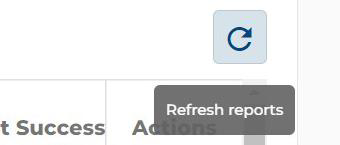

# Basic Features

## The navigation bar
Each portal module is listed on the left side of the screen for easy access from any working area within the portal.

This <i>side navigation bar</i> will display a variable **Expand/Collapse** icon next to any modules that
include sub-modules, based on your permissions in the system.

The side navigation bar can also be minimized to increase the available workspace and restored to
full width.

## Session time out
Your Web portal session will expire after 6 hours of inactivity. At the 1-minute mark before expiration,
a _banner_ will ask if you want to stay logged in. To do so, answer: `Stay logged in`.

If the period of inactivity extends further, the system will redirect the portal screen to the Login page.

## Real-time updates
The portal regularly updates `Orders` and `Inventory` data on the user’s entry into the module, while also
supporting real-time `Reports`.

### System calculation alert <!-- {docsify-ignore} -->
When the system is logging each user in, performing calculations, or updating data, this process may
take some time. Therefore, the Compass icon will swirl to indicate the operation is running.

## Tool captions
Tool captions serve as useful introductions and reminders about the software’s individual functions.
Hovering your mouse over an applicable icon will initiate a caption to display, defining the tool’s action.

