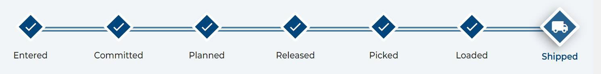

# Glossary

## Distribution Status Codes  <!-- {docsify-ignore} -->

### `Entered`
When all required information is correct on an electronic order, it will be imported in the Entered status OR if an On Hold status has been removed by an authorized user, the order will move to Entered.

### `On Hold`
The On Hold status indicates a manual hold by an authorized user, or a temporary system-initiated hold, has been placed on an order to prevent it from proceeding. Once an order is taken off the hold status, it cannot be returned to this status.

### `Committed`
An authorized user has completed the allocation process against available Inventory, but the has not released the order to the warehouse.

### `Released` 
An order has had Inventory committed to it, and the order has been printed and released to the warehouse for picking.

### `Picking`
The warehouse has started the process locating and pulling the ordered item/lot from its storage location.

### `Picked`
The entire order is picked and ready for packing, or the order is already packed.

### `Loading`
The Loading status is dependent on whether the shipment is by truck or small package:
* Truck orders — The warehouse is in the process of loading pallets on the truck.
* Small package — The Loading status could mean that not all packages have been shipped yet OR the order has physically shipped, but there was a system problem in closing the order.

### `Loaded`
For truck orders, the Loaded status indicates that the truck has been packed and is ready to depart. Once the shipment is in the Loaded status, the order can be closed, and the order will show in the system as Shipped.

### `Shipped`
All required scanning is completed, and the system has been updated to note the Shipped status.

### `Arrived` 
The Arrived status indicates that a truck shipment has reached its destination:
* For inbound receipts, this status is placed in the system when a truck containing an incoming shipment arrives at the transfer center loading dock.
* For outbound orders, the Arrived status is required before physical loading of an outgoing truck can begin.

### `Received` 
For an inbound shipment, the Received status indicates that all product has been received AND the Advanced Shipping Notice (ASN) has been closed by the warehouse.
