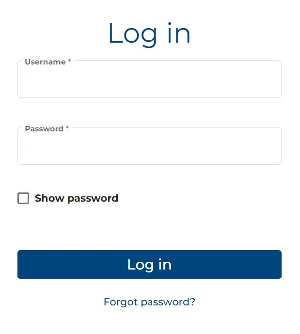
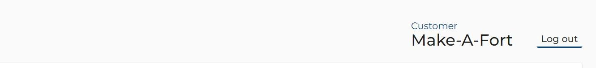

# Logging in and out
Enter the Username and Password in the provided fields, respectively. 

?> To assist with entering the correct password, check the box for `Show password`.

Click the Log in bar.

## Forgot password
Click the <b>Forgot password?</b> link, located under the `Log in` bar, and follow the prompts to contact Email Support through your default email application. A message will be sent to your email address, as registered in the system to assist you in resetting the password.

## First-time users
The address for the portal’s Login page will be sent to your email address, as provided by your organization’s Administrator, and will contain a return link and a temporary password.

Follow the prompts to reset the password to a unique set of alphanumeric and special characters, meeting the following requirements:

* 8 characters minimum
* Password must include:
* 1 number
* 1 uppercase letter
* 1 lowercase letter
* 1 special character: = + - ^ $ * . [ ] { } ( ) ? " ! @ # % & / \ , > < ' : ; | _ ~

## Logging out
To securely end the session, navigate to the top right portion of the screen, and press the `Log out` link, as
shown in the screenshot, below:

